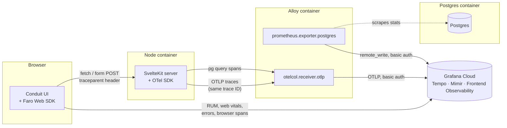

# Full-Stack Tracing for a SvelteKit + Postgres App, with Faro, OpenTelemetry, and Alloy

Most "observability" setups stop at the server. You get a nice trace for your API handler, maybe a span or two around the database call, and then... nothing. The click that actually kicked the whole thing off, sitting in the browser, is invisible. When someone reports "the app was slow for me around 2pm," you're stuck guessing whether the problem was their network, a slow render, a chunky bundle, or an actual backend issue.

This guide wires up the other half. By the end you'll have a single trace that starts at a click in the browser, runs through a SvelteKit server action, and ends at the exact Postgres query it triggered — all connected by one trace ID, all visible in one waterfall in Grafana Cloud.

The stack:

- **App** — [`app/`](app/) in this repo: the [sveltejs/realworld](https://github.com/sveltejs/realworld) example app (a Medium-style blogging clone called "Conduit"), UI and routes untouched, with a Postgres database wired in.
- **Frontend instrumentation** — [Grafana Faro Web SDK](https://github.com/grafana/faro-web-sdk) for RUM, Web Vitals, error capture, and browser-side tracing.
- **Backend instrumentation** — SvelteKit's native OpenTelemetry integration (2.31+), no manual span-wrapping required.
- **Collector** — [Grafana Alloy](https://grafana.com/docs/alloy/latest/), receiving OTLP traces from the backend and scraping Postgres metrics.
- **Backend-for-the-backend** — Grafana Cloud. No local Tempo/Loki/Mimir containers to run and forget about; both Alloy and the Faro SDK ship straight to your Cloud stack.

## The demo environment

`app/` is a working checkout of `sveltejs/realworld`, with one thing changed. The stock app doesn't have a database — its `+page.server.js` load functions call a public hosted demo API over the internet, and it ships with `@sveltejs/adapter-vercel`. That's fine for a frontend showcase; it's just not useful for a guide about tracing a request down to a SQL query.

So `app/` swaps in a real, local Postgres database instead, and nothing else. Every route, every `.svelte` component, every bit of UI is exactly as upstream scaffolded it. What actually changed:

| File | What it does here |
|---|---|
| [`svelte.config.js`](app/svelte.config.js) | `@sveltejs/adapter-node` instead of `adapter-vercel`, so it can self-host in Docker |
| [`src/lib/api.js`](app/src/lib/api.js) | Same four exports (`get`/`post`/`put`/`del`), same signatures, same response shapes — now backed by Postgres instead of the hosted demo API |
| [`src/lib/server/db.js`](app/src/lib/server/db.js) | The `pg` connection pool |
| [`db/init.sql`](app/db/init.sql) | Schema: users, articles, tags, comments, favorites, follows |
| [`Dockerfile`](app/Dockerfile), [`docker-compose.yml`](app/docker-compose.yml) | Multi-stage pnpm build; Postgres + app, nothing else yet |

That's it — no observability instrumentation anywhere in `app/` yet. It's a completely ordinary, working, self-hosted app with zero visibility into what it's doing. That's deliberate: the point of the rest of this guide is watching that change.

(`app/` is MIT-licensed, same as upstream — see [`app/LICENSE`](app/LICENSE) and the provenance note at the top of [`app/README.md`](app/README.md).)

## Architecture



Two things worth pointing at directly:

- The browser talks to **two** places: your own app (form posts, fetches) and Grafana Cloud directly (Faro's RUM payload). It does not go through Alloy — the Faro collector endpoint is designed to be called straight from client-side JS, the same way you'd embed an analytics snippet.
- Alloy's job shrinks to what actually needs a server-side component: receiving OTLP from your Node process (which needs a stable internal endpoint) and scraping Postgres (which the browser obviously can't do itself).

The arrow that makes this a *connected* trace rather than three separate dashboards is the top one — the `traceparent` header riding along on the browser's own request to your server. That's covered in detail in [Connecting frontend and backend traces](#connecting-frontend-and-backend-traces).

## Prerequisites

- Node.js 20+ and [pnpm](https://pnpm.io/)
- Docker and Docker Compose
- A [Grafana Cloud](https://grafana.com/products/cloud/) account — the free tier covers everything here
- About 20-30 minutes

## Environment variables

Every credential and endpoint this stack needs lives in one `.env` file (gitignored — never commit it), loaded by Docker Compose and (for Alloy) read at startup via `sys.env(...)`. `app/.env.example` already has the baseline block committed; the instrumentation step below adds the rest.

| Variable | Used by | Where it comes from |
|---|---|---|
| `POSTGRES_USER`, `POSTGRES_PASSWORD`, `POSTGRES_DB` | Postgres, app, Alloy | Already set in `.env.example` — local-only credentials, not secrets |
| `DATABASE_URL` | App, Alloy's Postgres exporter | Built from the three vars above, pointed at the `postgres` service |
| `PORT` | App | Whatever port you want the app to listen on inside the container |
| `ORIGIN` | App | The public URL you load the app from — `adapter-node` checks incoming form POSTs against this for CSRF protection |
| `PUBLIC_APP_ENV` | App, Faro, Alloy | Free-text tag (`local`, `staging`, `production`, …) that shows up as the `environment` attribute on Faro data and as `deployment.environment` on everything passing through Alloy |
| `OTEL_EXPORTER_OTLP_ENDPOINT` | App | Alloy's OTLP address on the internal Docker network — `http://alloy:4317` |
| `PUBLIC_FARO_COLLECTOR_URL` | Frontend (Faro SDK) | **Grafana Cloud → Frontend Observability → your app → "Web SDK Configuration"**. Safe to ship in client JS — it identifies which app to attribute events to, it's not a secret. |
| `GRAFANA_CLOUD_OTLP_ENDPOINT` | Alloy | **Grafana Cloud → your stack → Connections → Add new connection → OpenTelemetry (OTLP)** |
| `GRAFANA_CLOUD_INSTANCE_ID` | Alloy | Same OTLP connection page — used as the Basic Auth username |
| `GRAFANA_CLOUD_API_TOKEN` | Alloy | An [Access Policy Token](https://grafana.com/docs/grafana-cloud/account-management/authentication-and-permissions/access-policies/) with `metrics:write` and `traces:write` scopes, created from **Cloud Portal → Access Policies**. This one's a real secret — it stays server-side in Alloy and never ships to the browser. |

The last five don't exist yet — they get added when you instrument the app, not before.

---

## Start it

```bash
git clone https://github.com/colinedwardwood/faro-to-otel-tracing.git
cd faro-to-otel-tracing/app
cp .env.example .env
docker compose up --build
```

Nothing to fill in yet — `.env.example`'s baseline block is all local Postgres credentials, not secrets.

## Test it

Visit `http://localhost:3000`. Register an account, write an article, add a comment. It all persists — this is a real database, not a mock. Confirm it survives a restart if you want to labor the point.

Now ask the obvious question: if this were slow right now, where would you even look? There's no answer. One container log stream, no traces, no metrics, no idea whether a slow page load is the network, the render, or a query. That's the state every app starts in, and it's the whole reason the rest of this guide exists.

```bash
docker compose down
```

---

## Instrument it

### Frontend: Grafana Faro Web SDK

Grafana Cloud → **Frontend Observability** → your app → **Configure** walks you through this exact setup, and it's worth following its snippet almost verbatim rather than inventing your own shape — that page is also where `PUBLIC_FARO_COLLECTOR_URL` comes from.

**Set the CORS Allowed Origins first — it's easy to miss and it fails silently.** Same page, usually a separate tab or section from the SDK snippet. If it's empty, Grafana blocks every request from the browser with no error surfaced anywhere obvious — the POST just gets rejected by CORS before it leaves the browser. Set it to the app's actual origin:

```
http://localhost:3000
```

Matching is exact against the full origin (scheme + host + port), not just the hostname — a single `*` wildcard is allowed if you need to cover more than one (`http://localhost:*`), but avoid a bare `*` for anything you care about, since it lets anyone submit data to your endpoint. Allow ~2 minutes for a saved change to actually take effect.

**Choose your package type and install Faro:** select **NPM** (not Yarn — we're using pnpm, which is npm-registry-compatible; not CDN — we're importing this as a real package, not a `<script>` tag). Here's the `pnpm` equivalent of the `npm install` command the UI gives you:

```bash
pnpm add @grafana/faro-web-sdk @grafana/faro-web-tracing
```

**Session settings.** The Cloud UI also lets you set a session **Sampling Rate** (default 100%, i.e. every session tracked) and toggle **Persistent sessions** (sticky sessions that survive closing the tab, default off). Leave both at their defaults for this guide — they map to a `sessionTracking: { samplingRate, persistent }` block on `initializeFaro` that you only need to add if you actually change them from the defaults shown in the UI.

**Add Faro to your application:** select **Web**, not **React** — SvelteKit isn't React, and "Web" is the plain-JS SDK usage this guide's code actually is. The UI's own snippet — which we're matching structurally — looks like this:

```js
import { getWebInstrumentations, initializeFaro } from '@grafana/faro-web-sdk';
import { TracingInstrumentation } from '@grafana/faro-web-tracing';

initializeFaro({
  url: 'https://faro-collector-prod-us-central-0.grafana.net/collect/<your-app-key>',
  app: {
    name: 'temp',
    version: '1.0.0',
    environment: 'production'
  },
  instrumentations: [
    // Mandatory, omits default instrumentations otherwise.
    ...getWebInstrumentations(),

    // Tracing package to get end-to-end visibility for HTTP requests.
    new TracingInstrumentation()
  ]
});
```

**Copy the `url` value out of your own version of that snippet** — it'll look like `https://faro-collector-<region>.grafana.net/collect/<32-character-hex-app-key>` — and put it in `.env` as `PUBLIC_FARO_COLLECTOR_URL`. That's the one value from the Cloud UI's snippet you carry over by hand; everything else below is either identical every time (the imports, the instrumentations array) or deliberately parameterized instead of hardcoded (`app.name`, `app.environment`), for the reason right after this.

We're wrapping that in a small module — three differences from the Cloud UI's snippet above, each for a specific reason, nothing about what Faro actually does or observes changes:

1. **The Cloud UI's snippet calls `initializeFaro()` directly at module scope; ours wraps it in a function with a guard (`if (faro) return faro`).** That snippet assumes it's pasted into an entrypoint that runs exactly once per page load. That's not true here — `src/hooks.client.js` (next) gets picked up by Vite's dev-server hot-module-reload, so without the guard, every edit-triggered reload during `pnpm run dev` would call `initializeFaro()` again: duplicate error listeners, duplicate page-view counting. The guard is a one-line tax specifically for Vite dev mode; it's a no-op in production.
2. **The Cloud UI's snippet hardcodes `url` and `app.environment`; ours takes them as function arguments**, read from `.env` at runtime (`PUBLIC_FARO_COLLECTOR_URL`, `PUBLIC_APP_ENV`) instead of baked into the source at build time. Their instructions assume you're pasting a real, private collector URL into your own private codebase. This repo is public — hardcoding a live collector URL tied to a real account into committed source means anyone reading the guide could send data into that account indefinitely (see the callout above about copying the `url` value into `.env` instead). Parameterizing it also means the same built Docker image works against different Grafana Cloud accounts or environments without a rebuild.
3. **Ours returns the `faro` instance; the Cloud UI's snippet doesn't.** Minor — it lets other code call `initFaro()` later and get the live instance back (to call `faro.api.pushEvent(...)` from elsewhere, for instance), which a fire-and-forget snippet has no need for.

`src/lib/faro.js`:

```js
import { getWebInstrumentations, initializeFaro } from '@grafana/faro-web-sdk';
import { TracingInstrumentation } from '@grafana/faro-web-tracing';

let faro;

export function initFaro(collectorUrl, environment) {
  if (faro) return faro; // guard against HMR re-init in dev

  faro = initializeFaro({
    url: collectorUrl,
    app: {
      name: 'conduit-frontend',
      version: '1.0.0',
      environment
    },
    instrumentations: [
      // Mandatory, omits default instrumentations otherwise.
      ...getWebInstrumentations(),

      // Tracing package to get end-to-end visibility for HTTP requests.
      new TracingInstrumentation()
    ]
  });

  return faro;
}
```

`src/hooks.client.js` (new file — the app doesn't have one yet):

```js
import { browser } from '$app/environment';
import { env } from '$env/dynamic/public';
import { initFaro } from '$lib/faro.js';

if (browser) {
  initFaro(env.PUBLIC_FARO_COLLECTOR_URL, env.PUBLIC_APP_ENV ?? 'local');
}
```

`PUBLIC_FARO_COLLECTOR_URL` points straight at the collector URL from that Configure page — see [Environment variables](#environment-variables) above. We're reading it via `$env/dynamic/public` rather than `$env/static/public` specifically so the same built Docker image works against different collector URLs without a rebuild — static public vars get baked into the client bundle at build time, dynamic ones are read from the container's environment at request time.

Notice the `TracingInstrumentation()` above is bare, with no options — that's not a simplification on our part, it's exactly what the Cloud UI's own snippet gives you. Whether that's enough for full continuity depends on one thing, covered next.

### Backend: SvelteKit's native OpenTelemetry support

SvelteKit 2.31 added a first-class OpenTelemetry integration: an instrumentation hook (conceptually the same idea as Next.js's `instrumentation.ts`) plus automatic spans around routing, `load` functions, and form actions — no more hand-wrapping `handle` in `hooks.server.js` and hoping you caught every code path.

Turn it on in `svelte.config.js` — add the `experimental` block to what's already there:

```js
import adapter from '@sveltejs/adapter-node';

/** @type {import('@sveltejs/kit').Config} */
const config = {
	compilerOptions: {
		runes: true
	},
	kit: {
		adapter: adapter(),
		experimental: {
			// load src/instrumentation.server.js before any application code runs
			instrumentation: { server: true },
			// wrap SvelteKit's own internals (handle, load, actions) in spans
			tracing: { server: true }
		}
	}
};

export default config;
```

Install the OTel SDK pieces:

```bash
pnpm add @opentelemetry/api @opentelemetry/sdk-node \
  @opentelemetry/auto-instrumentations-node \
  @opentelemetry/exporter-trace-otlp-grpc \
  @opentelemetry/resources @opentelemetry/semantic-conventions
```

`src/instrumentation.server.js`:

```js
import { NodeSDK } from '@opentelemetry/sdk-node';
import { OTLPTraceExporter } from '@opentelemetry/exporter-trace-otlp-grpc';
import { getNodeAutoInstrumentations } from '@opentelemetry/auto-instrumentations-node';
import { resourceFromAttributes } from '@opentelemetry/resources';
import { ATTR_SERVICE_NAME, ATTR_SERVICE_VERSION } from '@opentelemetry/semantic-conventions';

const sdk = new NodeSDK({
  resource: resourceFromAttributes({
    [ATTR_SERVICE_NAME]: 'conduit-backend',
    [ATTR_SERVICE_VERSION]: '1.0.0'
  }),
  traceExporter: new OTLPTraceExporter({
    url: process.env.OTEL_EXPORTER_OTLP_ENDPOINT ?? 'http://localhost:4317'
  }),
  instrumentations: [
    getNodeAutoInstrumentations({
      // noisy and rarely worth the cardinality in a demo like this
      '@opentelemetry/instrumentation-fs': { enabled: false }
    })
  ]
});

sdk.start();
```

Ordering matters more here than it looks like it should. `getNodeAutoInstrumentations()` works by monkey-patching modules (`http`, `pg`, …) the first time they're `require`'d. If your app imports `pg` before this SDK starts, the patch never applies and you silently get no database spans. The `instrumentation.server` flag exists specifically to solve that — it tells the build produced by `adapter-node` to `--import` this file before your app's own entrypoint, so plain `node build` in the Dockerfile's `CMD` picks it up automatically, no extra flags needed.

This is also why you get Postgres query spans for free, without instrumenting `pool.query(...)` calls by hand: `@opentelemetry/instrumentation-pg` ships inside `auto-instrumentations-node`, and because our `pg` import in `db.js` is a totally ordinary one, it gets patched right along with everything else. Every query in `api.js` now produces a real child span with the SQL text attached — actual per-query tracing, not to be confused with the Postgres *metrics* Alloy scrapes below, which is a different, complementary layer (connection counts, cache hit ratio — the stuff a single trace can't tell you).

### Connecting frontend and backend traces

This is the mechanism that turns two separate instrumentation efforts into one observability story, so it's worth being explicit about it rather than just asserting "it works."

1. The browser submits the login form (or any `fetch` call fires). Faro's `TracingInstrumentation` intercepts it and starts a client-side span.
2. Because the request target (`http://localhost:3000/...`) is the **same origin** the page itself was loaded from, the underlying instrumentation attaches a [W3C `traceparent` header](https://www.w3.org/TR/trace-context/) automatically — no extra config required. It looks something like `traceparent: 00-4bf92f3577b34da6a3ce929d0e0e4736-00f067aa0ba902b7-01`, encoding the trace ID, the parent span ID, and sampling flags.
3. The request lands on the SvelteKit server. The `http` instrumentation inside `getNodeAutoInstrumentations()` reads that header off the incoming request and, instead of minting a new trace, continues the existing one — the first server-side span becomes a *child* of the browser's span, not a sibling.
4. Every span created after that in the same request — SvelteKit's own `tracing.server` spans around the action, the `pg` instrumentation's query span — inherits that same trace context via `AsyncLocalStorage`, which is how OpenTelemetry's Node context manager propagates state through async calls.
5. The browser ships its span to Grafana Cloud's Faro collector directly; the server ships its spans to Alloy, which forwards them to Grafana Cloud's OTLP gateway. Both land in the same Tempo instance. Tempo doesn't care which door a span came in through — it just assembles anything sharing a trace ID into one waterfall.

Net effect: open a trace in Grafana and the root span is a literal click, with the `INSERT INTO comments` (or whatever the action was) sitting a few levels down as a leaf. I checked this directly rather than taking it on faith — sending a request with a hand-crafted `traceparent` header and inspecting the resulting spans showed every one of them, including the `pg` query spans, carrying that exact trace ID, with the root span's parent marked `isRemote: true`.

The one thing that *would* break this: if your frontend and backend aren't actually on the same origin — a separate `api.yourapp.com` host, or a static frontend on a CDN calling back to a different origin server. Browsers only let JS attach arbitrary headers to a cross-origin request if that's been explicitly opted into, so `@grafana/faro-web-tracing` requires you to allow-list it: `new TracingInstrumentation({ instrumentationOptions: { propagateTraceHeaderCorsUrls: [/api\.yourapp\.com/] } })`. Conduit's frontend and backend are served from the same SvelteKit process on the same origin, which is exactly why the Cloud UI's default snippet — the bare `TracingInstrumentation()` above — is already enough here. If a trace ever shows up split into a frontend-only piece and a backend-only piece instead of one merged waterfall, a same-origin mismatch (wrong port, `www.` vs. bare domain, http vs. https) is the first thing to check, and a genuinely cross-origin setup missing `propagateTraceHeaderCorsUrls` is the second.

### Collector: Grafana Alloy

Alloy has two jobs, now that Faro reports straight to Grafana Cloud:

1. Accept OTLP traces from the SvelteKit backend.
2. Scrape Postgres for database-level metrics, using `prometheus.exporter.postgres` — an embedded exporter, no separate `postgres_exporter` container.

...then forward both to Grafana Cloud, authenticated.

Rather than hand-rolling a minimal pipeline, `alloy/config.alloy` below follows the shape Grafana Cloud's own "Configure Alloy" onboarding page suggests for a generic OTLP source — resource detection and a couple of attribute-cleanup passes included, not just a bare receiver-to-exporter pipe. It's more boilerplate than the smallest thing that could work, but it's boilerplate you'd otherwise end up writing yourself the first time you actually looked at what lands in Tempo:

```bash
mkdir -p alloy
```

```alloy
otelcol.receiver.otlp "default" {
  // https://grafana.com/docs/alloy/latest/reference/components/otelcol.receiver.otlp/

  // configures the default grpc endpoint "0.0.0.0:4317"
  grpc { }
  // configures the default http/protobuf endpoint "0.0.0.0:4318"
  http { }

  output {
    metrics = [otelcol.processor.resourcedetection.default.input]
    logs    = [otelcol.processor.resourcedetection.default.input]
    traces  = [otelcol.processor.resourcedetection.default.input]
  }
}

// Postgres metrics feed into the exact same enrichment pipeline as
// whatever the backend sends over OTLP above — one otelcol.receiver.prometheus
// bridges the prometheus.* scrape into it.
prometheus.exporter.postgres "conduit_db" {
  data_source_names = [sys.env("DATABASE_URL")]
}

prometheus.scrape "conduit_db" {
  targets         = prometheus.exporter.postgres.conduit_db.targets
  scrape_interval = "15s"
  forward_to      = [otelcol.receiver.prometheus.postgres.receiver]
}

otelcol.receiver.prometheus "postgres" {
  output {
    metrics = [otelcol.processor.resourcedetection.default.input]
  }
}

otelcol.processor.resourcedetection "default" {
  // https://grafana.com/docs/alloy/latest/reference/components/otelcol.processor.resourcedetection/
  detectors = ["env", "system"]

  system {
    hostname_sources = ["os"]

    resource_attributes {
      host.id   { enabled = true }
      host.name { enabled = true }
    }
  }

  output {
    metrics = [otelcol.processor.transform.drop_unneeded_resource_attributes.input]
    logs    = [otelcol.processor.transform.drop_unneeded_resource_attributes.input]
    traces  = [otelcol.processor.transform.drop_unneeded_resource_attributes.input]
  }
}

otelcol.processor.transform "drop_unneeded_resource_attributes" {
  // https://grafana.com/docs/alloy/latest/reference/components/otelcol.processor.transform/
  error_mode = "ignore"

  trace_statements {
    context    = "resource"
    statements = [
      "delete_key(attributes, \"k8s.pod.start_time\")",
      "delete_key(attributes, \"os.description\")",
      "delete_key(attributes, \"os.type\")",
      "delete_key(attributes, \"process.command_args\")",
      "delete_key(attributes, \"process.executable.path\")",
      "delete_key(attributes, \"process.pid\")",
      "delete_key(attributes, \"process.runtime.description\")",
      "delete_key(attributes, \"process.runtime.name\")",
      "delete_key(attributes, \"process.runtime.version\")",
    ]
  }

  metric_statements {
    context    = "resource"
    statements = [
      "delete_key(attributes, \"k8s.pod.start_time\")",
      "delete_key(attributes, \"os.description\")",
      "delete_key(attributes, \"os.type\")",
      "delete_key(attributes, \"process.command_args\")",
      "delete_key(attributes, \"process.executable.path\")",
      "delete_key(attributes, \"process.pid\")",
      "delete_key(attributes, \"process.runtime.description\")",
      "delete_key(attributes, \"process.runtime.name\")",
      "delete_key(attributes, \"process.runtime.version\")",
    ]
  }

  log_statements {
    context    = "resource"
    statements = [
      "delete_key(attributes, \"k8s.pod.start_time\")",
      "delete_key(attributes, \"os.description\")",
      "delete_key(attributes, \"os.type\")",
      "delete_key(attributes, \"process.command_args\")",
      "delete_key(attributes, \"process.executable.path\")",
      "delete_key(attributes, \"process.pid\")",
      "delete_key(attributes, \"process.runtime.description\")",
      "delete_key(attributes, \"process.runtime.name\")",
      "delete_key(attributes, \"process.runtime.version\")",
    ]
  }

  output {
    metrics = [otelcol.processor.transform.add_resource_attributes_as_metric_attributes.input]
    logs    = [otelcol.processor.batch.default.input]
    traces  = [otelcol.processor.batch.default.input]
  }
}

otelcol.processor.transform "add_resource_attributes_as_metric_attributes" {
  // https://grafana.com/docs/alloy/latest/reference/components/otelcol.processor.transform/
  error_mode = "ignore"

  metric_statements {
    context    = "datapoint"
    statements = [
      "set(attributes[\"deployment.environment\"], resource.attributes[\"deployment.environment\"])",
      "set(attributes[\"service.version\"], resource.attributes[\"service.version\"])",
    ]
  }

  output {
    metrics = [otelcol.processor.batch.default.input]
  }
}

otelcol.processor.batch "default" {
  // https://grafana.com/docs/alloy/latest/reference/components/otelcol.processor.batch/
  output {
    metrics = [otelcol.exporter.otlphttp.grafana_cloud.input]
    logs    = [otelcol.exporter.otlphttp.grafana_cloud.input]
    traces  = [otelcol.exporter.otlphttp.grafana_cloud.input]
  }
}

otelcol.exporter.otlphttp "grafana_cloud" {
  // https://grafana.com/docs/alloy/latest/reference/components/otelcol.exporter.otlphttp/
  client {
    endpoint = sys.env("GRAFANA_CLOUD_OTLP_ENDPOINT")
    auth     = otelcol.auth.basic.grafana_cloud.handler
  }
}

otelcol.auth.basic "grafana_cloud" {
  // https://grafana.com/docs/alloy/latest/reference/components/otelcol.auth.basic/
  username = sys.env("GRAFANA_CLOUD_INSTANCE_ID")
  password = sys.env("GRAFANA_CLOUD_API_TOKEN")
}
```

A few things worth being explicit about, since most of this differs from what you'd write starting from a blank file:

- **`otelcol.receiver.prometheus`** is the bridge component that lets a `prometheus.scrape` target's output flow into an otelcol pipeline — it's named `"postgres"` here since it sits alongside the receiver for the backend's own OTLP traffic in the same file.
- **`resourcedetection`** stamps every span, metric, and log with attributes about *where Alloy itself is running* — container/host identity, mainly — which is a genuinely useful thing to have on data whether or not you asked for it, hence why the Cloud UI defaults to including it rather than leaving it as a manual add-on.
- **The two `transform` processors exist for a very specific reason**: `getNodeAutoInstrumentations()` on the Node side (and `resourcedetection`'s own `system` detector) attach a pile of process/OS resource attributes — PID, executable path, OS description, and so on — that are mostly noise once you're looking at a dashboard rather than a single trace. The first `transform` deletes them. The second exists because Prometheus/Mimir metrics don't have a concept of "resource" attributes the way traces and logs do — only per-series labels — so `deployment.environment` and `service.version` have to be explicitly copied from the resource onto every metric *datapoint* or they're silently dropped rather than becoming queryable labels.
- **`otelcol.auth.basic`** turns your instance ID and API token into the Basic Auth header Grafana Cloud's OTLP gateway expects, and it's attached to the *exporter*, not the receiver — Alloy itself doesn't require auth from your own app, only Grafana Cloud does. Grafana Cloud's own generated snippet for this hardcodes both values directly into `config.alloy` (`username = "477393"`, `password = "your-grafana-token"` — literally your API token, in plaintext, in a file you're one `git add .` away from committing). We're reading both from `sys.env(...)` instead, same as everywhere else in this guide, specifically so that never happens.
- **The exporter is `otelcol.exporter.otlphttp`, not `otelcol.exporter.otlp`.** Grafana Cloud's OTLP gateway only accepts OTLP over HTTP — the endpoint URL even has an HTTP path on it (`/otlp`). The plain `otelcol.exporter.otlp` component defaults to gRPC, and pointing it at this endpoint fails with a gRPC resolver error (`no children to pick from`) rather than anything that obviously says "wrong protocol." I hit exactly this running the stack against a real Grafana Cloud account while writing this guide — if you see that error, this is almost certainly why.

One more thing worth calling out: the Postgres user in `DATABASE_URL` is the same one the app itself uses, for simplicity. Past a local demo, give the exporter its own read-only role instead — `GRANT pg_monitor TO exporter_user;` is enough for the stats views it needs, and there's no reason to hand it your application credentials.

The `add_resource_attributes_as_metric_attributes` processor above only does something useful if a `deployment.environment` resource attribute actually exists on the data flowing through it — our Node backend's own resource (in `instrumentation.server.js`) only sets `service.name` and `service.version`. Rather than touch the app for this, we set it once, centrally, on the collector — see the `alloy` service's `OTEL_RESOURCE_ATTRIBUTES` below, which is the standard OpenTelemetry environment variable every "env" resource detector — this one included — already knows to read.

### Bring the alloy service into docker-compose

Add it to the existing `docker-compose.yml`:

```yaml
services:
  postgres:
    # ...unchanged...

  app:
    build: .
    restart: unless-stopped
    depends_on:
      postgres:
        condition: service_healthy
      alloy:
        condition: service_started
    env_file: .env
    ports:
      - "3000:3000"

  alloy:
    image: grafana/alloy:latest
    restart: unless-stopped
    env_file: .env
    environment:
      # picked up by config.alloy's resourcedetection "env" detector and
      # stamped onto every span/metric/log passing through Alloy
      OTEL_RESOURCE_ATTRIBUTES: deployment.environment=${PUBLIC_APP_ENV}
    volumes:
      - ./alloy/config.alloy:/etc/alloy/config.alloy:ro
    command:
      - run
      - --server.http.listen-addr=0.0.0.0:12345
      - /etc/alloy/config.alloy
    ports:
      - "12345:12345" # Alloy's own UI — a live graph of the pipeline above, worth a look
    depends_on:
      postgres:
        condition: service_healthy

volumes:
  pgdata:
```

(`app`'s `depends_on` picked up the new `alloy` entry — that's the only change to the service itself.)

Append the rest of the environment to `.env`:

```bash
OTEL_EXPORTER_OTLP_ENDPOINT=http://alloy:4317
PUBLIC_APP_ENV=local
PUBLIC_FARO_COLLECTOR_URL=<from Grafana Cloud>
GRAFANA_CLOUD_OTLP_ENDPOINT=<from Grafana Cloud>
GRAFANA_CLOUD_INSTANCE_ID=<from Grafana Cloud>
GRAFANA_CLOUD_API_TOKEN=<from Grafana Cloud>
```

Bring it up:

```bash
docker compose up --build
```

### See it in Grafana Cloud

- App: `http://localhost:3000`. Register, log in, write an article, add a comment — same actions as before, this time with somewhere to look.
- Alloy's UI: `http://localhost:12345` — renders the component graph from `config.alloy` visually, which makes wiring mistakes obvious the first time through.
- In your Grafana Cloud stack:
  - **Frontend Observability** — RUM sessions, Web Vitals, and the browser-side event stream for `conduit-frontend` shows up here within a few seconds of using the app.
  - **Explore → Tempo** — search by service name `conduit-frontend` or `conduit-backend`, open a trace from a comment submission. The root span should be the browser click, with the SvelteKit action and the `INSERT INTO comments` query nested underneath it.
  - **Explore → Metrics (Mimir)** — query `pg_up` or browse `pg_stat_*` to confirm the Postgres scrape is landing.

---

## Do it with one command instead

Everything under "Instrument it" is mechanical — the same files, every time, applied to `app/`. `scripts/instrument.sh` applies all of it in one pass: installs the Faro/OTel packages, writes `src/instrumentation.server.js`, `src/hooks.client.js`, `src/lib/faro.js`, `alloy/config.alloy`, updates `svelte.config.js` and `docker-compose.yml`, and appends the observability block to `.env.example`.

```bash
cd app
../scripts/instrument.sh
cp .env.example .env   # then fill in your Grafana Cloud values
docker compose up --build
```

It refuses to run if it looks like the app is instrumented already, and it does *not* create a Grafana Cloud account or generate credentials for you — that step is still on you. Full script: [`scripts/instrument.sh`](scripts/instrument.sh).

---

## Troubleshooting

- **Frontend and backend traces show up separately in Tempo, never merged.** For this app, that almost always means the browser request wasn't actually same-origin — a mismatched port or `http` vs. `https` is enough to break it. If you've split the frontend and backend onto genuinely different origins, you additionally need `propagateTraceHeaderCorsUrls` set on `TracingInstrumentation` to match the backend's real origin (see [Connecting frontend and backend traces](#connecting-frontend-and-backend-traces)).
- **No spans from the backend at all.** Confirm both `experimental.instrumentation.server` and `experimental.tracing.server` are set in `svelte.config.js`, and that you rebuilt the image afterward — this is a build-time flag, not a runtime one.
- **Form posts fail with a 403.** SvelteKit's CSRF check validates the request's origin against `ORIGIN`. Missing or wrong value in `.env` is almost always the cause.
- **Nothing shows up in Frontend Observability.** Three possible causes: (1) `PUBLIC_FARO_COLLECTOR_URL` wasn't copied exactly (including the trailing app key) or didn't reach the client bundle — it has to be prefixed `PUBLIC_` and present in the app container's environment at request time; (2) the CORS Allowed Origins field on the Cloud Portal's Configure page is empty or doesn't match — check the browser's own console/network tab for a CORS error, and remember changes take ~2 minutes to propagate after saving; (3) **the browser console shows `Cross-Origin Request Blocked... Reason: CORS request did not succeed. Status code: (null)`** — that specific error (no status code at all, request never completed) is not a server-side CORS misconfiguration, it's something on the client blocking the request before it leaves the browser. Firefox's Enhanced Tracking Protection and ad-blocker/privacy extensions both commonly classify `/collect/` endpoints as trackers and silently kill them. Try a private window with extensions off, or a different browser, before touching any config — you can confirm the server side is fine independently with `curl -i -X OPTIONS <collector-url> -H "Origin: <your-origin>" -H "Access-Control-Request-Method: POST" -H "Access-Control-Request-Headers: content-type,x-faro-session-id"` and checking for a `204` with matching `access-control-allow-origin`/`access-control-allow-headers`.
- **Alloy logs `401 Unauthorized` talking to the OTLP gateway.** Wrong instance ID, wrong token, or a token missing the `traces:write`/`metrics:write` scopes. Regenerate it from Cloud Portal → Access Policies rather than guessing at the scope names.
- **Alloy logs `Exporting failed... rpc error: code = Unavailable desc = no children to pick from`.** This is a gRPC resolver error, and it means the exporter is configured for gRPC against an endpoint that only speaks HTTP. Make sure `config.alloy` uses `otelcol.exporter.otlphttp`, not `otelcol.exporter.otlp` — see the callout in [Collector: Grafana Alloy](#collector-grafana-alloy).
- **Docker build fails on `pnpm prune --prod` with `ERR_PNPM_ABORTED_REMOVE_MODULES_DIR_NO_TTY`.** pnpm refuses to prune non-interactively without being told it's a CI environment. `ENV CI=true` before the prune step in `app/Dockerfile` fixes it — it's already there, but easy to lose if you're customizing the build stage.
- **Postgres metrics never show up.** Confirm `DATABASE_URL` resolves inside the Docker network (`postgres`, not `localhost`) and that the user in it can read `pg_stat_*` views.
- **Alloy logs `failed to get host ID... empty "host.id"` on startup.** Harmless — `resourcedetection`'s `host.id` detector wants `/etc/machine-id`, which plain Docker containers don't have. It's a warning, not an error, and everything still exports fine; ignore it unless you've deliberately bind-mounted the host's machine-id in.

## Where to go from here

- Turn on Faro's [session replay](https://grafana.com/docs/grafana-cloud/monitor-applications/frontend-observability/session-replay/) integration and pivot straight from a replay to the backend trace it produced.
- Add exemplars so Mimir panels link directly into the Tempo trace that produced a given data point — Alloy is already shipping both, so it's mostly a Grafana dashboard config change.
- Fill in the tag-update gap in `updateArticle` and the rest of the RealWorld spec's edge cases in `app/src/lib/api.js` if you want this to be a genuinely complete backend rather than a tracing demo with a database attached.
- **Upload source maps.** Right now, any JS error Faro captures shows a minified/bundled stack trace, not real source. [`@grafana/faro-rollup-plugin`](https://www.npmjs.com/package/@grafana/faro-rollup-plugin) (Vite is Rollup-compatible) handles this from `vite.config.js`, or `faro-cli upload` does it as a post-build step — either way it needs its own credentials, separate from everything else in this guide: a Faro *API* endpoint (`https://faro-api-<region>.grafana.net/faro/api/v1` — not the collector URL), plus `appId`, `apiKey`, and `stackId` from Frontend Observability → Settings → Source Maps → Configure source map uploads. One real wrinkle for this app specifically: Grafana's docs don't address SSR, and SvelteKit's `vite.config.js` runs through separate client and server build passes under `adapter-node` — the plugin needs to be scoped to the client pass only, since server output was never meant to be uploaded.
